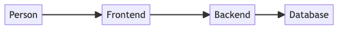

# GPT Text to Design Diagram

Using OpenAI GPT models, from a description of a software system or other entity diagram, generate a design diagram image or PDF.

## Installation

Install from npm with `npm install gpt-text-to-diagram`.

## Usage

1. Set the `OPENAI_KEY` environment variable or pass the key into the `generate` command with the `-k` flag.
2. Run the `gpt-text-to-diagram` command with the following options:

    ```bash
    Options:
      -V, --version                    output the version number
      -p, --prompt <prompt>            Required: Software system description to create design from.
      -k, --key <openAIKey>            Optional: OpenAI API Key. Must be passed in through the CLI or environment variable.
      -o, --output-file <filePath>     Optional: Output filename template. Must have an extension of png, pdf, or svg. (default: "diagram.png")
      -m, --model <modelName>          Optional: OpenAI completion model to use. (default: "text-davinci-003")
      -c, --max-tokens <tokenCount>    Optional: Make tokens to use when generating the response. (default: 500)
      -t, --temperature <temperature>  Optional: The temperature parameter to use for the GPT model generation. (default: 0.2)
      -h, --help                       Display helpful information about the CLI.
      ```

## Example

Running the command:

```bash
gpt-text-to-diagram generate -p "Entities: Person, Frontend, Backend, Database. Person interacts with the frontend. The frontend sends requests to the backend. The backend performs CRUD operations on data in the database."  -o test.png -t 0.8 -c 250
```

Generated the following design diagram:


